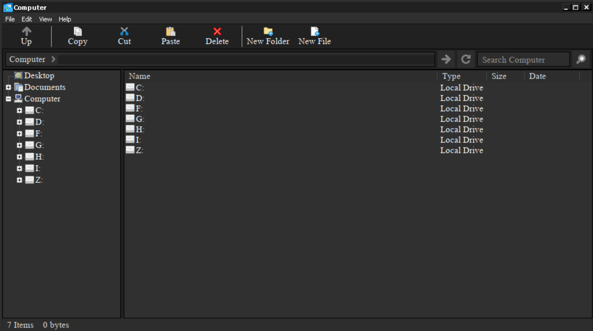
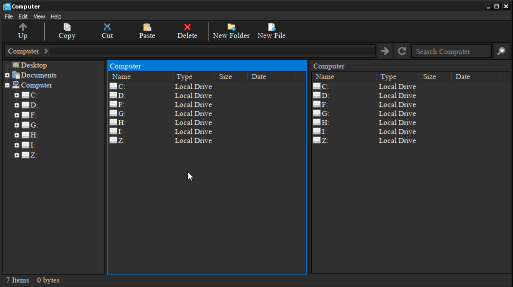
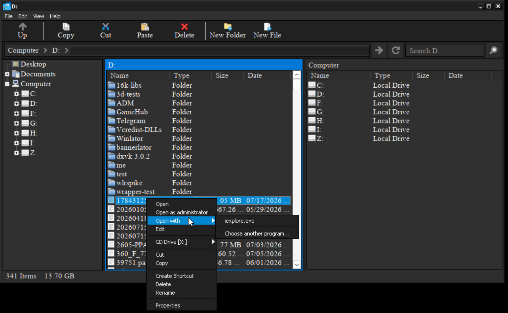

# Banner File Manager

**Banner File Manager (BFM)** is the in-container file manager for
[**Bannerlator**](https://github.com/The412Banner/Bannerlator) — a lightweight, native
Windows file manager that runs inside Wine/Proton containers on Android. It is a fork of the
[Winlator File Manager](https://github.com/brunodev85/wfm) by **BrunoSX** (MIT), extended
with a dual-pane mode, richer file actions, quality-of-life features, and full light/dark
theme support.

It ships on disk as `wfm.exe` (keeping the Bannerlator launch path unchanged) and is
deployed into a container's `C:\windows\wfm.exe`.

## Preview

Runs inside a Bannerlator container and **honors the container's light and dark theme
settings** — the whole UI (column header, status bar, search field, and address-bar
buttons included) follows the active theme.

| Single pane | Dual-pane split view | File actions |
| :---: | :---: | :---: |
|  |  |  |

<sub>Shown in dark mode; light mode is fully supported and matches the container theme.</sub>

## Features

**Core**
- Tree + list navigation with breadcrumb address bar, path typing, and search.
- Copy / cut / paste / delete / rename, new file / new folder, create shortcuts.
- Details / list / small-icon / large-icon views with click-to-sort columns.
- ISO / BIN / CUE image mounting (via `libcdio`).

**Dual-pane (split) view** — `View ▸ Split View`
- Two independent folder panes side by side; the active pane is accent-highlighted.
- Each pane has its own path bar; click a pane to make it active.
- Copy in one pane, paste into the other.

**File actions**
- **Open as administrator** (`runas`).
- **Open with ▸** — a submenu of registered applications, plus *Choose another program…*
  which opens Wine's Open-With dialog.
- **Properties** dialog (name, type, location, size, modified date).

**Quality of life**
- Keyboard shortcuts: `F2` rename, `Del` delete, `F5` refresh, `F6` toggle split,
  `Backspace` up, `Enter` open, `Ctrl+C/X/V/A`.
- **Show Hidden Files** toggle (`View` menu).
- Byte-accurate **copy progress bar** with cancel.
- Status bar shows item count **and total size** of the current folder.

**Performance**
- **Large folders load and scroll without stalling.** File size and date are taken
  straight from the directory enumeration instead of stat-ing every file, so a folder of
  thousands of entries no longer does thousands of sync round-trips at load time.
- Icon and type-name lookups are **cached per file extension** and persist across
  navigation, so re-entering a folder (or opening another folder of the same file types)
  is instant. The list is virtual — only visible rows are ever realized.

**Reliability**
- Copy / move / delete are implemented directly on Win32 file APIs
  (`CopyFileExW` / `MoveFileExW` / `DeleteFileW` + manual recursion) instead of shell32
  `SHFileOperation`. This sidesteps the Wine `shell32` copy-paste crash seen on Proton
  10.0-4 and enables real byte-level progress + cancel.
- The binary carries a proper Windows **version resource** (company, product, version),
  so it shows correct file properties and is no longer flagged by reputation-based
  antivirus heuristics for missing metadata.

**Appearance**
- Segoe UI font, full-row selection, flicker-free (double-buffered) list.
- **Follows the container's light or dark theme.** Several common controls that Wine
  renders light regardless of theme (the column header, status bar, search field,
  address-bar buttons, and the list/tree scrollbars) are owner-drawn to match the active
  theme, and re-color on a live theme switch.

## Compatibility

The x86-64 build is **universal** across Bannerlator's container arches:

| Container | Translator | Runs |
| --- | --- | --- |
| x86-64 | Box64 | natively |
| arm64ec | wowbox64 (x64-on-arm64ec) | ✓ |
| any | FEXCore | ✓ |

There is no CPU-arch-specific code — BFM is a plain Win32 application, so the translator
only affects instruction execution, not behavior.

## Build

**Windows (as upstream):** `w64devkit` + the provided `Makefile` / `build.bat`.

**Cross-compile (x86-64), as CI does:**

```sh
CC=x86_64-w64-mingw32-gcc
RC=x86_64-w64-mingw32-windres
INCLUDES="-I./include -I./include/libcdio"
CFLAGS="-O2 -std=c99 -DUNICODE -D_UNICODE -DCOBJMACROS -DWINVER=0x0600 -Wall"
SRCS="main content_view toolbar navbar treeview sizebar statusbar file_node file_actions input_dialog"

mkdir -p obj
for f in $SRCS; do $CC $CFLAGS $INCLUDES -c "src/$f.c" -o "obj/$f.o"; done
$RC $INCLUDES -I./res -i res/resource.rc -o obj/resource.o
$CC -o wfm.exe obj/*.o -s -lcomctl32 -lgdi32 -lole32 -luuid -luxtheme ./libcdio.dll -Wl,--subsystem,windows
```

`.github/workflows/build-x64.yml` runs this on Ubuntu with `mingw-w64` and publishes
`wfm.exe` + `libcdio.dll` as a build artifact. `libcdio.dll` must sit next to `wfm.exe`
(it provides ISO-mount support).

## License

Banner File Manager is licensed under the **GNU General Public License v3.0 or later**
(GPL-3.0-or-later) — see [`LICENSE`](LICENSE).
Copyright © 2026 The412Banner.

- It incorporates code from the **Winlator File Manager** © 2023 **BrunoSX**, originally
  under the MIT License. That code remains under MIT; its notice is preserved in
  [`LICENSE.WFM`](LICENSE.WFM). MIT-licensed code may be incorporated into a GPL work.
- It bundles and links **`libcdio`** (for ISO/BIN/CUE mounting), which is itself
  **GPL-3.0-or-later**. Because the distributed `wfm.exe` links libcdio, the combined
  binary is governed by the GPL — which is why the project as a whole is GPL-licensed.

Credits: **BrunoSX** (original WFM) and the **libcdio** authors.
